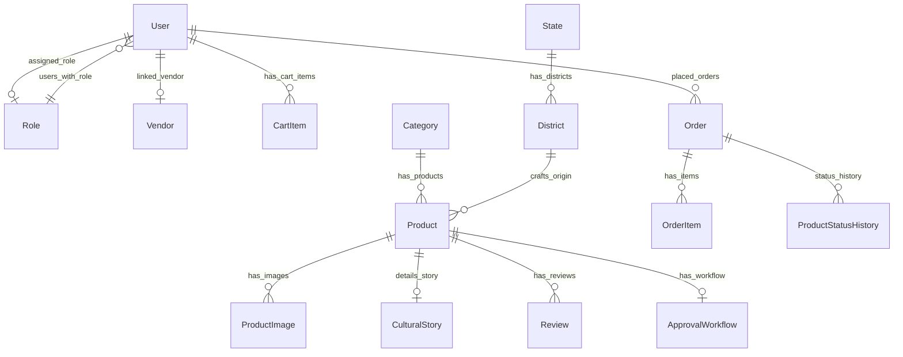

# Cultural Clutch: Database Schema

This document details the normalized relational database schema (SQLite/Postgres) utilized by the Cultural Clutch enterprise platform.

---

## 1. Schema Diagram Overview (Mermaid)

---

## 2. Table Definitions

### 1. `User`
Stores client and employee account details.
- `id` (String, PK, UUID) - Primary identifier.
- `name` (String) - Full name.
- `email` (String, Unique) - Login credentials email.
- `phone` (String, Optional) - OTP verification phone.
- `passwordHash` (String) - Secure bcrypt password hash.
- `roleId` (String, FK -> `Role.id`) - Associated system role.
- `isSuspended` (Boolean) - Suspension toggle flag.
- `createdAt` / `updatedAt` (DateTime) - Audit timestamps.

### 2. `Role`
Encapsulates enterprise-level access capabilities.
- `id` (String, PK, UUID) - Unique identifier.
- `name` (String, Unique) - System role label (e.g. `Owner`, `Finance Manager`).
- `permissions` (String) - Serialized JSON permissions payload (specifying allowed pages, components, and APIs).

### 3. `Vendor`
Details business credentials for local artisans and cooperatives.
- `id` (String, PK, UUID) - Unique identifier.
- `userId` (String, FK -> `User.id`, Unique) - Associated user profile.
- `businessName` (String) - Business legal entity name.
- `ownerName` (String) - Artisan group manager.
- `gstin` / `pan` (String, Optional) - Compliance registration codes.
- `bankDetails` (String, Optional) - Secure payouts destination account.

### 4. `Category`
Tracks product classifications.
- `id` (String, PK, UUID) - Unique identifier.
- `name` (String, Unique) - Category name.
- `slug` (String, Unique) - URL-safe slug path.

### 5. `Product`
Houses craft catalog data and inventory counts.
- `id` (String, PK, UUID) - Unique identifier.
- `name` (String) - Heritage product name.
- `slug` (String, Unique) - URL-safe slug path.
- `sku` (String, Unique) - Stock keeping unit identifier.
- `price` (Float) - Price in INR (₹).
- `stock` (Int) - Warehouse stock counts.
- `categoryId` (String, FK -> `Category.id`) - Associated category.
- `districtId` (String, FK -> `District.id`) - Geographical craft origin.
- `vendorId` (String, FK -> `Vendor.id`, Optional) - Onboarding supplier vendor.
- `isActive` (Boolean) - Access toggle flag.

### 6. `CulturalStory`
Stores documentation and significance for ODOP craft listings.
- `id` (String, PK, UUID) - Unique identifier.
- `productId` (String, FK -> `Product.id`, Unique) - Associated product listing.
- `artisanName` (String) - Artisan credit name.
- `history` (String) - Regional history origin.
- `productionMethod` (String) - Step-by-step weaving/handcrafting details.

### 7. `Order`
Maintains sales orders lifecycle.
- `id` (String, PK, UUID) - Unique identifier.
- `userId` (String, FK -> `User.id`) - Customer profile.
- `status` (String) - Current fulfillment stage (e.g. `Pending`, `Delivered`).
- `totalAmount` (Float) - Total transaction price (₹).
- `trackingNumber` (String, Optional) - Logistics tracking code.
- `carrier` (String, Optional) - Courier partner.

---

## 3. Database Indexes

To optimize read speeds across the 980+ static routes, the following indexes are generated in the schema:

1. `idx_users_email` - Unique index on `User.email` for high-speed login lookups.
2. `idx_prod_slug` - Unique index on `Product.slug` for static page route builds.
3. `idx_prod_sku` - Unique index on `Product.sku` for warehouse scanning and stock adjustments.
4. `idx_orders_user` - Index on `Order.userId` for client-side transaction logs fetches.
